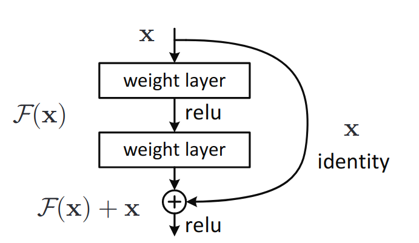
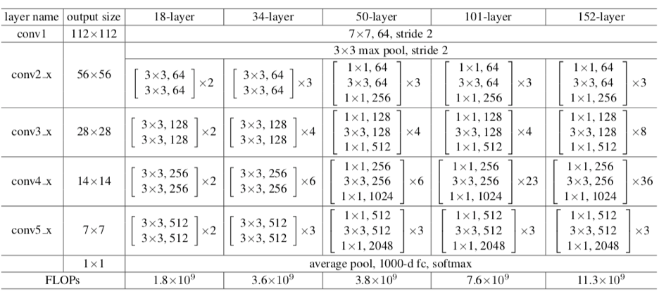
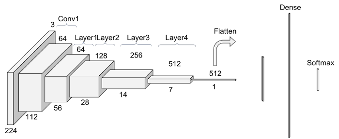
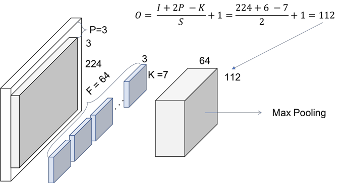
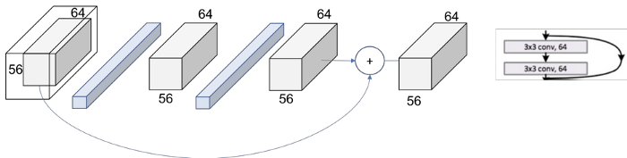
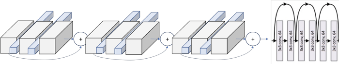

# Understanding ResNet and analyzing various models

## Introduction
Deeper neural networks are more difficult to train. We present a residual learning framework to ease the training
of networks that are substantially deeper than those used previously. We explicitly reformulate the layers as learning residual functions with reference to the layer inputs, instead of learning unreferenced functions. We provide comprehensive empirical evidence showing that these residual networks are easier to optimize, and can gain accuracy from considerably increased depth. On the ImageNet dataset we evaluate residual nets with a depth of up to 152 layers 8X deeper than VGG nets but still having lower complexity.

## What problems ResNets solve?
One of the problems ResNets solve is the famous known **vanishing gradient**. This is because when the network is too deep, the gradients from where the loss function is calculated easily shrink to zero after several applications of the chain rule. This result on the weights never updating its values and therefore, no learning is being performed.

With ResNets, the gradients can flow directly through the skip connections backwards from later layers to initial filters.

Here, we have something called Residual blocks. Many Residual blocks are stacked together to form a ResNet. We have “skipped connections” which are the major part of ResNet. The following image was provided by the authors in the original paper which denotes how a residual network works. The idea is to connect the input of a layer directly to the output of a layer after skipping a few connections. We can see here, $x$ is the input to the layer which we are directly using to connect to a layer after skipping the identity connections and if we think the output from identity connection to be $F(x)$. Then we can say the output will be $F(x) + x$.

## Architecture
In the table, there is a summary of the output size at every layer and the dimension of the convolutional kernels at every point in the structure.

So, let's go layer by layer.

### Convolution 1

The first step on the ResNet before entering the common layer behavior is a block — called here Conv1 — consisting on a convolution + batch normalization + max pooling operation.

They use a kernel size of 7, and a feature map size of 64. You need to infer that they have padded with zeros 3 times on each dimension.

### ResNet Layers

So, let’s explain this repeating name, block. Every layer of a ResNet is composed of several blocks. This is because when ResNets go deeper, they normally do it by increasing the number of operations within a block, but the number of total layers remains the same — 4. An operation here refers to a convolution a batch normalization and a ReLU activation to an input, except the last operation of a block, that does not have the ReLU.

Therefore, in the PyTorch implementation they distinguish between the blocks that includes 2 operations — **CNN Block** — and the blocks that include 3 operations — **Bottleneck Block**. Note that normally each of these operations is called layer, but we are using layer already for a group of blocks.

*Layer 1 block 1*

*Layer 1*

### Patterns

The next step is to escalate from the entire block to the entire layer. In the Figure 1 we can see how the layers are differentiable by colors. However, if we look at the first operation of each layer, we see that the stride used at that first one is 2, instead of 1 like for the rest of them.

This means that the down sampling of the volume though the network is achieved by increasing the stride instead of a pooling operation like normally CNNs do. In fact, only one max pooling operation is performed in our Conv1 layer, and one average pooling layer at the end of the ResNet, right before the fully connected dense layer in Figure 1.

This difference on the skip connections are the so called in the paper as Identity Shortcut and Projection Shortcut. The identity shortcut is the one we have already discussed, simply bypassing the input volume to the addition operator. The projection shortcut performs a convolution operation to ensure the volumes at this addition operation are the same size. From the paper we can see that there are 2 options for matching the output size. Either padding the input volume or perform 1x1 convolutions.

## Key Features of ResNet:

1. ResNet uses Batch Normalization at its core. The Batch Normalization adjusts the input layer to increase the performance of the network. The problem of covariate shift is mitigated.
2. ResNet makes use of the Identity Connection, which helps to protect the network from vanishing gradient problem.
3. Deep Residual Network uses bottleneck residual block design to increase the performance of the network.

## References
[1] [Deep Residual Learning for Image Recognition](https://arxiv.org/pdf/1512.03385.pdf) \
[2] [Understanding ResNet and analyzing various models on the CIFAR-10 dataset](https://www.analyticsvidhya.com/blog/2021/06/understanding-resnet-and-analyzing-various-models-on-the-cifar-10-dataset/) \
[3] [Detailed Guide to Understand and Implement ResNets](https://cv-tricks.com/keras/understand-implement-resnets/)
