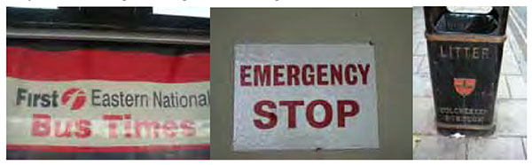
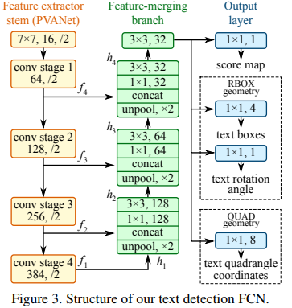

# OpenCV Text Detection with EAST

In this tutorial, you will learn how to use OpenCV to detect text in images using the EAST text detector.

The EAST text detector requires that we are running OpenCV 3.4.2 or OpenCV 4 on our systems — if you do not already have OpenCV 3.4.2 or better installed, please refer to my [OpenCV install guides](https://www.pyimagesearch.com/opencv-tutorials-resources-guides/) and follow the one for your respective operating system.

In the first part of today’s tutorial, I’ll discuss why detecting text in natural scene images can be so challenging.

From there I’ll briefly discuss the EAST text detector, why we use it, and what makes the algorithm so novel — I’ll also include links to the original paper so you can read up on the details if you are so inclined.

Finally, I’ll provide my Python + OpenCV text detection implementation so you can start applying text detection in your own applications.

# Why is natural scene text detection so challenging?



*Figure 1: Examples of natural scene images where text detection is challenging due to lighting conditions, image quality, and non-planar objects (Figure 1 of [Mancas-Thillou and Gosselin](https://www.tcts.fpms.ac.be/publications/regpapers/2007/VS_cmtbg2007.pdf)).*

Detecting text in constrained, controlled environments can typically be accomplished by using heuristic-based approaches, such as exploiting gradient information or the fact that text is typically grouped into paragraphs and characters appear on a straight line. An example of such a heuristic-based text detector can be seen in my previous blog post on [Detecting machine-readable zones in passport images.](https://www.pyimagesearch.com/2015/11/30/detecting-machine-readable-zones-in-passport-images/)

## Natural scene text detection is different though — and much more challenging.

Due to the proliferation of cheap digital cameras, and not to mention the fact that nearly every smartphone now has a camera, we need to be highly concerned with the conditions the image was captured under — and furthermore, what assumptions we can and cannot make. I’ve included a summarized version of the natural scene text detection challenges described by Celine Mancas-Thillou and Bernard Gosselin in their excellent 2017 paper, **Natural Scene Text Understanding** below:

- **Image/sensor noise**: Sensor noise from a handheld camera is typically higher than that of a traditional scanner. Additionally, low-priced cameras will typically interpolate the pixels of raw sensors to produce real colors.
- **Viewing angles**: Natural scene text can naturally have viewing angles that are not parallel to the text, making the text harder to recognize.
- **Blurring**: Uncontrolled environments tend to have blur, especially if the end user is utilizing a smartphone that does not have some form of stabilization.
- **Lighting conditions**: We cannot make any assumptions regarding our lighting conditions in natural scene images. It may be near dark, the flash on the camera may be on, or the sun may be shining brightly, saturating the entire image.
- **Resolution**: Not all cameras are created equal — we may be dealing with cameras with sub-par resolution.
- **Non-paper objects**: Most, but not all, paper is not reflective (at least in context of paper you are trying to scan). Text in natural scenes may be reflective, including logos, signs, etc.
- **Non-planar objects**: Consider what happens when you wrap text around a bottle — the text on the surface becomes distorted and deformed. While humans may still be able to easily “detect” and read the text, our algorithms will struggle. We need to be able to handle such use cases.
- **Unknown layout**: We cannot use any a priori information to give our algorithms “clues” as to where the text resides.

# The EAST deep learning text detector


With the release of OpenCV 3.4.2 and OpenCV 4, we can now use a deep learning-based text detector called EAST, which is based on Zhou et al.’s 2017 paper, [EAST: An Efficient and Accurate Scene Text Detector.](https://arxiv.org/abs/1704.03155)

We call the algorithm “EAST” because it’s an: **E**fficient and **A**ccurate **S**cene **T**ext detection pipeline.

The EAST pipeline is capable of predicting words and lines of text at arbitrary orientations on 720p images, and furthermore, can run at 13 FPS, according to the authors.

Perhaps most importantly, since the deep learning model is end-to-end, it is possible to sidestep computationally expensive sub-algorithms that other text detectors typically apply, including candidate aggregation and word partitioning.

To build and train such a deep learning model, the EAST method utilizes novel, carefully designed loss functions.

# Project structure

```
$ tree --dirsfirst
.
├── images
│   ├── car_wash.png
│   ├── lebron_james.jpg
│   └── sign.jpg
├── NMSBoxes.py
├── frozen_east_text_detection.pb
├── text_detection.py
└── text_detection_video.py
```
Notice that I’ve provided three sample pictures in the `images/` directory. You may wish to add your own images collected with your smartphone or ones you find online.

We’ll be reviewing two `.py` files today:

- `text_detection.py` : Detects text in static images.
- `text_detection_video.py` : Detects text via your webcam or input video files.

# Implementation notes
The text detection implementation I am including today is based on [OpenCV’s official C++ example](https://github.com/opencv/opencv/blob/master/samples/dnn/text_detection.cpp); however, I must admit that I had a bit of trouble when converting it to Python.

To start, there are no `Point2f` and `RotatedRect` functions in Python, and because of this, I could not 100% mimic the C++ implementation. The C++ implementation can produce rotated bounding boxes, but unfortunately the one I am sharing with you today cannot.

Secondly, the `NMSBoxes` function does not return any values for the Python bindings (at least for my OpenCV 4 pre-release install), ultimately resulting in OpenCV throwing an error. The `NMSBoxes` function may work in OpenCV 3.4.2 but I wasn’t able to exhaustively test it.

I got around this issue my using my own [non-maxima suppression](https://www.pyimagesearch.com/2015/02/16/faster-non-maximum-suppression-python/) implementation in [imutils](https://github.com/jrosebr1/imutils/blob/master/imutils/object_detection.py#L4), but again, I don’t believe these two are 100% interchangeable as it appears `NMSBoxes` accepts additional parameters.

# Implementing our text detector with OpenCV

At this point your system is now configured, so open up `text_detection.py` and insert the following code:

```
# import the necessary packages
from NMSBoxes import non_max_suppression
import numpy as np
import argparse
import time
import cv2
# construct the argument parser and parse the arguments
ap = argparse.ArgumentParser()
ap.add_argument("-i", "--image", type=str,
	help="path to input image")
ap.add_argument("-east", "--east", type=str,
	help="path to input EAST text detector")
ap.add_argument("-c", "--min-confidence", type=float, default=0.5,
	help="minimum probability required to inspect a region")
ap.add_argument("-w", "--width", type=int, default=320,
	help="resized image width (should be multiple of 32)")
ap.add_argument("-e", "--height", type=int, default=320,
	help="resized image height (should be multiple of 32)")
args = vars(ap.parse_args())
```

To begin, we import our required packages and modules on Lines 2-6. Notably we import NumPy, OpenCV, and my implementation of `non_max_suppression` from `NMSBoxes` .

We then proceed to parse five command line arguments on Lines 9-20:

- `--image` : The path to our input image.
- `--east` : The EAST scene text detector model file path.
- `--min-confidence` : Probability threshold to determine text. Optional with  `default=0.5` .
- `--width` : Resized image width — must be multiple of 32. Optional with `default=320` .
- `--height` : Resized image height — must be multiple of 32. Optional with `default=320` .

**Important**: The EAST text requires that your input image dimensions be multiples of 32, so if you choose to adjust your --width and --height values, make sure they are multiples of 32!

From there, let’s load our image and resize it:

```
# load the input image and grab the image dimensions
image = cv2.imread(args["image"])
orig = image.copy()
(H, W) = image.shape[:2]
# set the new width and height and then determine the ratio in change
# for both the width and height
(newW, newH) = (args["width"], args["height"])
rW = W / float(newW)
rH = H / float(newH)
# resize the image and grab the new image dimensions
image = cv2.resize(image, (newW, newH))
(H, W) = image.shape[:2]
```

In order to perform text detection using OpenCV and the EAST deep learning model, we need to extract the output feature maps of two layers:

```
# define the two output layer names for the EAST detector model that
# we are interested -- the first is the output probabilities and the
# second can be used to derive the bounding box coordinates of text
layerNames = [
	"feature_fusion/Conv_7/Sigmoid",
	"feature_fusion/concat_3"]
```
We construct a list of `layerNames`:

1. The first layer is our output sigmoid activation which gives us the probability of a region containing text or not.
2. The second layer is the output feature map that represents the “geometry” of the image — we’ll be able to use this geometry to derive the bounding box coordinates of the text in the input image.

Let’s load the OpenCV’s EAST text detector:

```
# load the pre-trained EAST text detector
print("[INFO] loading EAST text detector...")
net = cv2.dnn.readNet(args["east"])
# construct a blob from the image and then perform a forward pass of
# the model to obtain the two output layer sets
blob = cv2.dnn.blobFromImage(image, 1.0, (W, H),
	(123.68, 116.78, 103.94), swapRB=True, crop=False)
start = time.time()
net.setInput(blob)
(scores, geometry) = net.forward(layerNames)
end = time.time()
# show timing information on text prediction
print("[INFO] text detection took {:.6f} seconds".format(end - start))
```

We load the neural network into memory using `cv2.dnn.readNet` by passing the path to the EAST detector (contained in our command line args dictionary) as a paramete.

Then we prepare our image by converting it to a `blob`. To read more about this step, refer to Deep learning: [How OpenCV’s blobFromImage works](https://www.pyimagesearch.com/2017/11/06/deep-learning-opencvs-blobfromimage-works/).

To predict text we can simply set the `blob` as input and call `net.forward`. These lines are surrounded by grabbing timestamps so that we can print the elapsed time.

By supplying `layerNames` as a parameter to `net.forward` , we are instructing OpenCV to return the two feature maps that we are interested in:

- The output `geometry` map used to derive the bounding box coordinates of text in our input images
- And similarly, the `scores` map, containing the probability of a given region containing text
We’ll need to loop over each of these values, one-by-one:

```
# grab the number of rows and columns from the scores volume, then
# initialize our set of bounding box rectangles and corresponding
# confidence scores
(numRows, numCols) = scores.shape[2:4]
rects = []
confidences = []
# loop over the number of rows
for y in range(0, numRows):
	# extract the scores (probabilities), followed by the geometrical
	# data used to derive potential bounding box coordinates that
	# surround text
	scoresData = scores[0, 0, y]
	xData0 = geometry[0, 0, y]
	xData1 = geometry[0, 1, y]
	xData2 = geometry[0, 2, y]
	xData3 = geometry[0, 3, y]
	anglesData = geometry[0, 4, y]
```

We start off by grabbing the dimensions of the scores volume and then initializing two lists:

- `rects` : Stores the bounding box (x, y)-coordinates for text regions
- `confidences` : Stores the probability associated with each of the bounding boxes in `rects`

We’ll later be applying non-maxima suppression to these regions.

Next, we loop over each of the column indexes for our currently selected row:

```
# loop over the number of columns
for x in range(0, numCols):
	# if our score does not have sufficient probability, ignore it
	if scoresData[x] < args["min_confidence"]:
		continue
	# compute the offset factor as our resulting feature maps will
	# be 4x smaller than the input image
	(offsetX, offsetY) = (x * 4.0, y * 4.0)
	# extract the rotation angle for the prediction and then
	# compute the sin and cosine
	angle = anglesData[x]
	cos = np.cos(angle)
	sin = np.sin(angle)
	# use the geometry volume to derive the width and height of
	# the bounding box
	h = xData0[x] + xData2[x]
	w = xData1[x] + xData3[x]
	# compute both the starting and ending (x, y)-coordinates for
	# the text prediction bounding box
	endX = int(offsetX + (cos * xData1[x]) + (sin * xData2[x]))
	endY = int(offsetY - (sin * xData1[x]) + (cos * xData2[x]))
	startX = int(endX - w)
	startY = int(endY - h)
	# add the bounding box coordinates and probability score to
	# our respective lists
	rects.append((startX, startY, endX, endY))
	confidences.append(scoresData[x])
```

For every row, we begin looping over the columns.

We need to filter out weak text detections by ignoring areas that do not have sufficiently high probability.

The EAST text detector naturally reduces volume size as the image passes through the network — our volume size is actually 4x smaller than our input image so we multiply by four to bring the coordinates back into respect of our original image.

I’ve included how you can extract the `angle` data; however, as I mentioned in the previous section, I wasn’t able to construct a rotated bounding box from it as is performed in the C++ implementation — if you feel like tackling the task, starting with the angle would be your first step.

From there, derive the bounding box coordinates for the text area.

We then update our `rects` and `confidences` lists, respectively.

We’re almost finished!

The final step is to apply non-maxima suppression to our bounding boxes to suppress weak overlapping bounding boxes and then display the resulting text predictions:

```
# apply non-maxima suppression to suppress weak, overlapping bounding
# boxes
boxes = non_max_suppression(np.array(rects), probs=confidences)
# loop over the bounding boxes
for (startX, startY, endX, endY) in boxes:
	# scale the bounding box coordinates based on the respective
	# ratios
	startX = int(startX * rW)
	startY = int(startY * rH)
	endX = int(endX * rW)
	endY = int(endY * rH)
	# draw the bounding box on the image
	cv2.rectangle(orig, (startX, startY), (endX, endY), (0, 255, 0), 2)
# show the output image
cv2.imshow("Text Detection", orig)
cv2.waitKey(0)
```


As I mentioned in the previous section, I could not use the non-maxima suppression in my OpenCV 4 install (`cv2.dnn.NMSBoxes` ) as the Python bindings did not return a value, ultimately causing OpenCV to error out. I wasn’t fully able to test in OpenCV 3.4.2 so it may work in v3.4.2.

Instead, I have used my non-maxima suppression implementation available in the imutils package . The results still look good; however, I wasn’t able to compare my output to the `NMSBoxes` function to see if they were identical.

Loop over our bounding `boxes` , scale the coordinates back to the original image dimensions, and draw the output to our `orig` image. The `orig` image is displayed until a key is pressed.

As a final implementation note I would like to mention that our two nested for loops used to loop over the `scores` and `geometry` volumes would be an excellent example of where you could leverage Cython to dramatically speed up your pipeline. I’ve demonstrated the power of Cython in [Fast, optimized ‘for’ pixel loops with OpenCV and Python](https://pyimagesearch.com/2017/08/28/fast-optimized-for-pixel-loops-with-opencv-and-python/).

# Referance

[pyimagesearch](https://www.pyimagesearch.com/2018/08/20/opencv-text-detection-east-text-detector/)