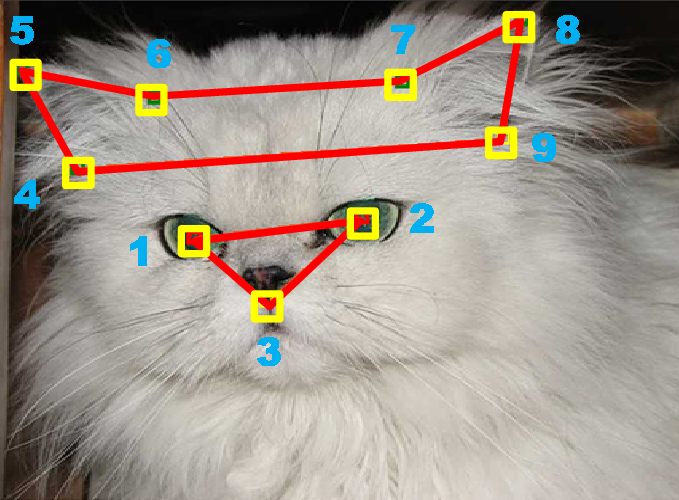

# Cat face landmark



Number of points (default is 9)
1. Left Eye
2. Right Eye
3. Mouth
4. Left Ear-1
5. Left Ear-2
6. Left Ear-3
7. Right Ear-1
8. Right Ear-2
9. Right Ear-3

## Directory Structure

├─── data
│    ├─── train
│    ├─── val    
│    ├─── test    
│    |    ├─── xxx.jpg
│    |    └─── xxx.jpg.cat
|    |─── train.txt
|    ├─── val.txt
|    └─── test.txt
│           
├───outputs
│
├─── dataset.py
├─── models.py
├─── train.py
├─── utils.py
├─── config.py
├─── test.py


## Data set: [CAT Dataset](https://archive.org/details/CAT_DATASET)
https://www.kaggle.com/crawford/cat-dataset

## Training
``` python3 train.py ```

## Test
``` python3 test ```